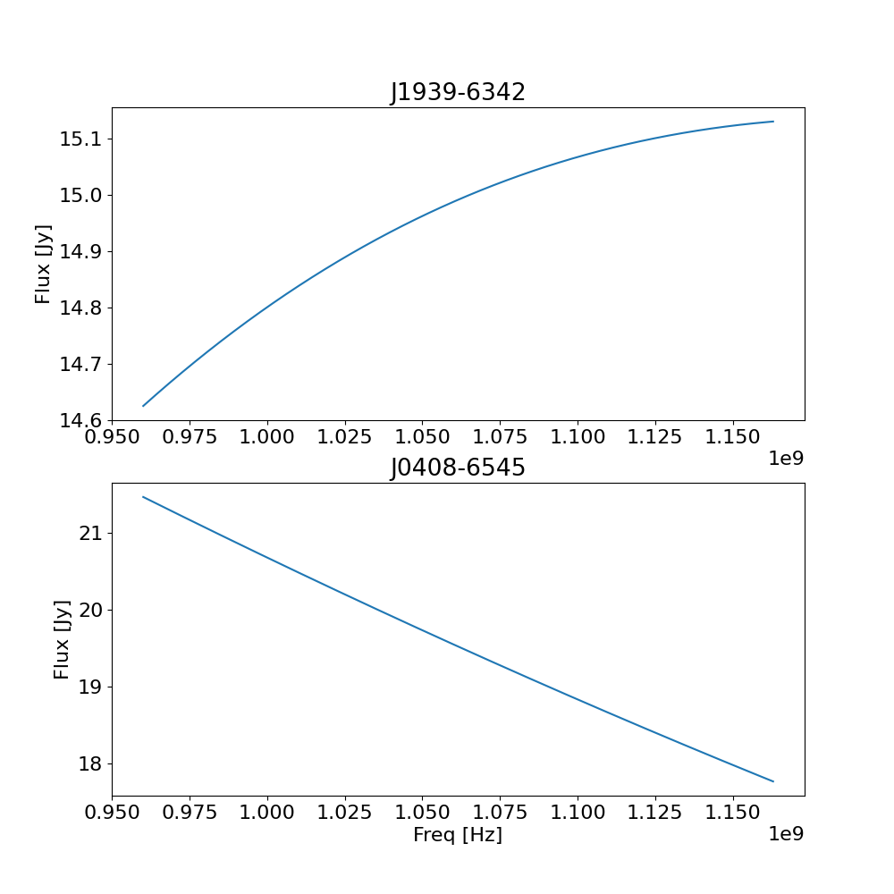
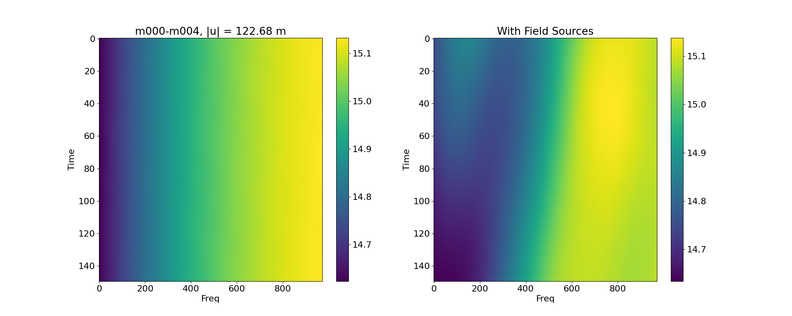
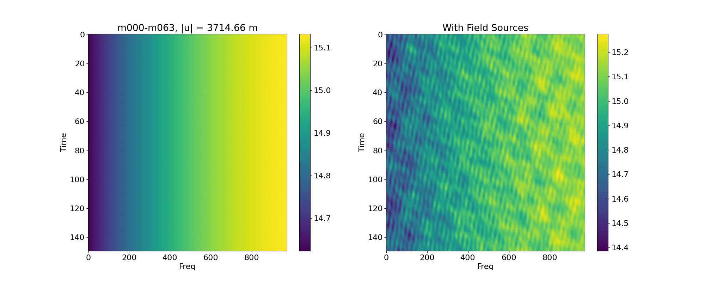

# Impact of field sources on calibration errors

This note follows [Heywood 2020](https://arxiv.org/pdf/2004.00454).

## Field Sources in model visibilities
The MeerKAT observations use two primary calibrators (see [docs](https://skaafrica.atlassian.net/wiki/spaces/ESDKB/pages/1481408634/Flux+and+bandpass+calibration)), J1939-6342 and J0408-6545. In the sub-band in L-band, the flux models for these two calibrators are:

Note in particular that J1939-6342 actually goes up for the frequency sub-band.

If a standard `casa` `setjy` task is used to create the model visibilities for calibration, only this central calibrator is used to construct the model visibility. In that case, for every baseline, across all time-steps, the model visibility is just the same flux shown above, with no phase.

However, obviously there are other sources in your field-of-view. These sources add fringe patterns to your visibilities, which will be time and frequency dependent. Shorter baselines will have larger structure and vice versa. An illustration:

Therefore, it is natural to speculate that, if you do not include field sources when calibrating the bandpass, some calibration error will arise from the insufficient modelling. The errors will be frequency and baseline dependent.

## Testing on 1530399641
I choose Block ID 1530399641 for testing this. This block includes observations of both primary calibrators.